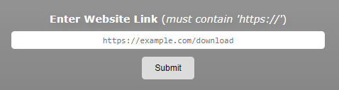
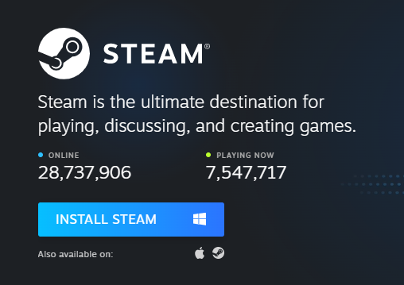

# **Installr** ⬇️ - *Release 1.3.2*
Installr is a multi-application installer tool that gets rid of constantly installing multiple applications online.

Instead of doing the grueling task of downloading the same 15 apps on your new computer, or multiple computers at a time, Installr gets rid of the time-consuming task of going to all these websites and condenses them into a one-time setup task that installs everything in the click of one button.

## **Update 1.3.2 Notes** 📝
- Added a "Visit On GitHub" footer button that redirects the user to the website's GitHub repository.
- Made the hover color for the footer buttons a lighter grey.
- Added a link counter by using the ``allLinks.length`` statement. Updates every **submit**, **load**, or **run**.
- Rounded The Footer Buttons From ``30px`` to ``10px``.
- Made it where the website will use an ``alert()`` statement to let you know if you sucessfully save your links or not.

## **Disclaimer ⚠️**
Installr is no longer in active development, but you can check on what i've added over time below.
- [x] **Download Caching** 💾 \
This feature will need to get implemented because, without it, it completely renders this program useless.

- [x] **Major Rewrite** ✍️ \
This entire project needs a rewrite since it was put together in a few hours, and the CSS is a mess and not easy to build off of.

- [x] **Style Change** 🦋 \
Self-explanatory, just needs a facelift before I deem this finished

## **Instructions, In-Depth 🗣️**
All you do is enter the link of the install or website, and when the **Run Install** button is clicked, it'll redirect you to every website in that list. Oh, and due to security reasons, your pop-up blocker will have to be disabled beforehand.

### **Mounting Links/Applications**
 \
This is where you'll enter the link for the app/website. When the ``Add Install`` button is clicked, it'll add that link to the ```appsList``` variable to be loaded when the ``Run Install`` button is clicked.

Your entry must be a **proper link**, or it won't run correctly or open the right page. It's important your link includes...
* An HTTPS:// Protocol (*example: https://example.com*)
* An Url Ending Like *.com* or *.net*

### **Finding Install Links**
You can find any install link by going somwhere like ``https://store.steampowered.com/about/`` and right clicking the install button, in this case a blue *Install Steam* button, and copying the link to that button. Once you have that link, you can paste in into *Installr* and add it to the ``appsList``.

